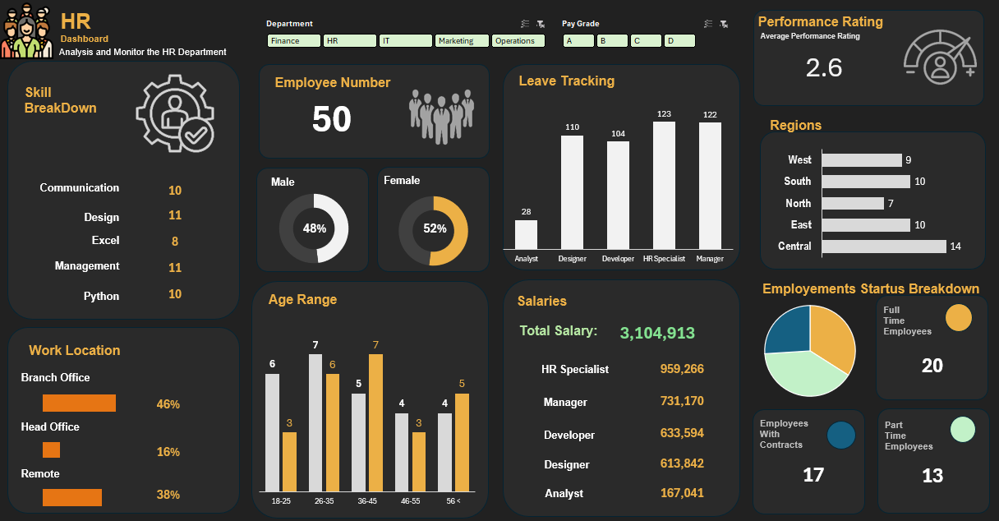

# 📊 HR Analysis Dashboard
## 📷 Dashboard Preview

## 📌 Project Overview
This project presents an interactive **HR Analytics Dashboard** designed to analyze workforce data and provide insights into employee distribution, performance, salaries, and organizational structure.

The dashboard helps HR managers and decision-makers monitor key HR metrics such as employee demographics, salary distribution, skills, and employment status.

---

## 🎯 Project Objectives
- Analyze employee data across different departments and job roles
- Monitor employee performance ratings
- Understand salary distribution among job positions
- Track leave patterns and workforce demographics
- Identify skill distribution among employees
- Support HR decision making with data-driven insights

---

## 📂 Dataset Information
The dataset used for this analysis contains employee-related information including:

- Employee ID
- Department
- Job Role
- Skills
- Age Group
- Gender
- Salary
- Region
- Employment Type (Full-time / Part-time / Contract)
- Performance Rating

---

## 📈 Dashboard Features

### 👥 Workforce Overview
- Total number of employees
- Gender distribution (Male vs Female)
- Department filter for analysis

### ⭐ Performance Analysis
- Average employee performance rating
- Pay grade classification (A, B, C, D)

### 📊 Skill Breakdown
Shows distribution of employee skills:
- Communication
- Design
- Excel
- Management
- Python

### 🏢 Work Location
Employee distribution across:
- Branch Office
- Head Office
- Remote Work

### 📉 Leave Tracking
Tracks leave counts for job roles:
- Analyst
- Designer
- Developer
- HR Specialist
- Manager

### 👨‍💼 Age Distribution
Employee age groups:
- 18–25
- 26–35
- 36–45
- 46–55
- 56+

### 💰 Salary Analysis
Total salary expenditure and breakdown by roles:
- HR Specialist
- Manager
- Developer
- Designer
- Analyst

### 🌍 Regional Distribution
Employees distributed across:
- West
- South
- North
- East
- Central

### 📋 Employment Status
Breakdown of employment types:
- Full-time employees
- Part-time employees
- Contract employees

---

## 🛠 Tools & Technologies Used
- Power BI
- Microsoft Excel
- Data Visualization
- Data Cleaning & Transformation
- HR Analytics

---

## 📷 Dashboard Preview

---

## 🚀 Key Insights
- Majority of employees fall within the **26–35 age group**
- Branch offices employ the largest percentage of staff
- Developers and HR specialists represent a large portion of salary expenditure
- Balanced gender distribution across employees
- Remote work and contract employment represent a notable share of the workforce

---

## 👤 Author
**Naimur Rahman**

📧 Email: b180304053@stat.jnu.ac.bd  
🔗 LinkedIn: https://www.linkedin.com/in/naimurrahman33  
🌐 Portfolio: https://naimurrah1.github.io/Naimur-Rahman-Website/
